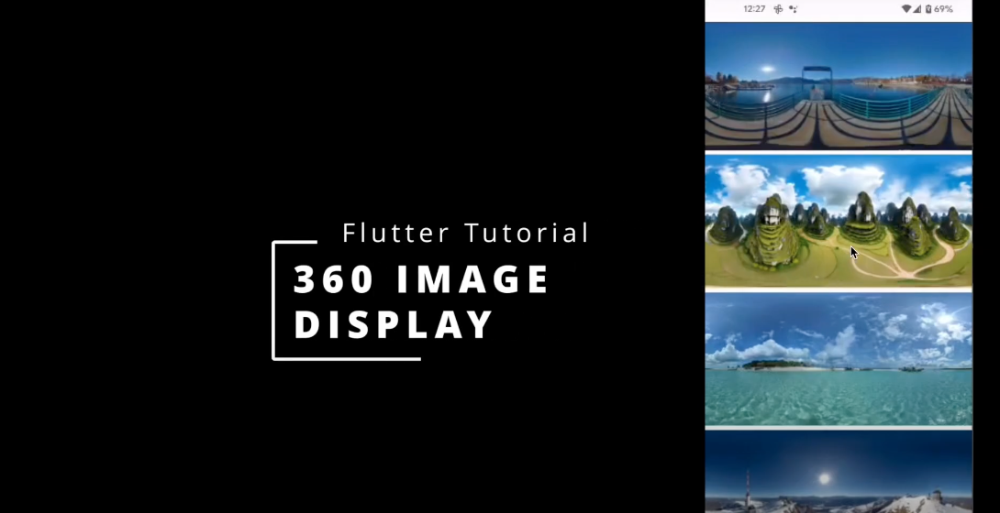

# 360 Image Flutter Tutorial

[https://codetricity.github.io/dot_guide_pano/](https://codetricity.github.io/dot_guide_pano/)

## Tutorials

* [#1 - Flutter 360 Image Tutorial for Beginners and How to Get Free 360 Images](https://youtu.be/if7wsdf-z9Q)
* [#2 - Flutter 360 Image Thumbnail Tutorial](https://youtu.be/F05f08IdDzU)
* [#3 - Flutter Deployment to Web with GitHub Actions Using flutter-actions and flutter-gh-pages](https://youtu.be/y7Bi7ilCbbQ)

## Getting Images

[Free 360 images for software development testing](https://community.theta360.guide/t/free-360-images-for-development-tests/9566?u=craig)
